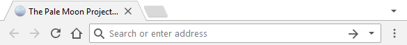

# Material Moon

A material chrome-like theme. Remember the material design in the new edition of Chrome? Well then, they have already arrived here in Pale Moon.

A fork of [PMChrome](https://github.com/Lootyhoof/pmchrome/), which is a fork of the theme [FXChrome](https://addons.mozilla.org/en-US/firefox/addon/fxchrome/) by dkgo.

## Building
Simply download the contents of the "src" folder  and pack the contents into a .zip file. Then, rename the file to .xpi and drag into the browser.

## Download
Check the releases page of this repository or visit its page on the [Pale Moon Add-ons Site](https://addons.palemoon.org/themes/material-moon/).